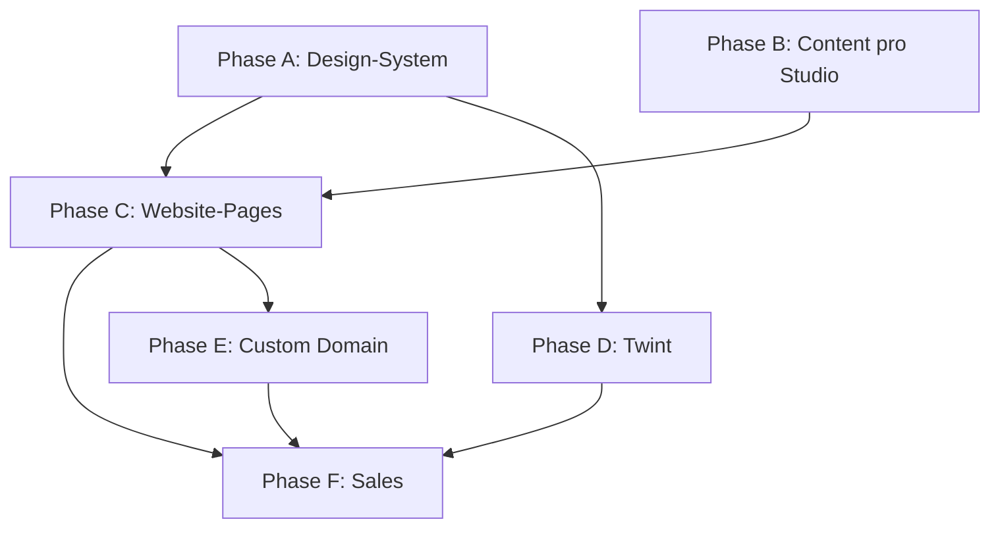

# Prototyp-Plan — Top 5 Leads (Website-Ersatz + Premium-Design)

**Stand:** 2026-06-19  
**Branch:** `cursor/prototype-top5-plan-2514`  
**Status:** Planung (keine Umsetzung)  
**Ziel:** Verkaufsfähige, vorgelabelte Prototypen, die die bestehende Kunden-Website **ersetzen** können — nicht nur ein `/book`-Widget.

---

## 1. Ausgangslage & Gap-Analyse

### Was das MVP heute ist

| Bereich | MVP-Stand | Verkaufsfähigkeit |
|---|---|---|
| Public Pages | `/{slug}` (1 Absatz) + `/{slug}/book` (Formular) | ❌ Kein Website-Ersatz |
| Design | Tailwind-Default, `primaryColor`, einfacher Header | ❌ Nicht „Apple-like“, nicht premium |
| Inhalte | Nur Name, Adresse, 3 generische Services (Seed) | ❌ Keine echten Website-Inhalte |
| Zahlung Kunde | Keine | ❌ **Twint fehlt komplett** |
| Domain | Nur Subpath `app…/{slug}` | ❌ Kein Custom Domain / DNS-Plan |
| SEO | Kein Meta, kein Schema.org, keine Sitemap | ❌ |
| Rechtliches | Kein Impressum/Datenschutz pro Studio | ❌ Pflicht in CH |
| Medien | Kein Bild-Upload, keine Galerie | ❌ |

**Fazit:** Das MVP ist ein technischer Proof-of-Concept für Buchungslogik — kein Sales-Prototyp. Für den Anruf beim Kunden brauchen wir **Website + Buchung + Branding + echte Inhalte** in einem Paket.

### Was „Prototyp“ für Sales bedeutet

Der Kunde soll nach dem Demo-Gespräch denken:

> „Das ist meine neue Website. Ich kann die alte löschen, die Domain umhängen, fertig.“

Dafür braucht jeder der 5 Leads:

1. **Vollständige öffentliche Site** (Home, Über uns, Leistungen/Preise, Team, Kontakt, Anfahrt, Impressum, Datenschutz)
2. **Integrierte Online-Buchung** (nicht extern verlinkt)
3. **Studio-spezifisches Premium-Design** (Fotos, Farben, Typo)
4. **Twint als Zahlungsoption** (mindestens sichtbar im Flow, idealerweise funktional)
5. **Custom Domain** oder zumindest klarer Migrationspfad

---

## 2. Design-System: „Apple-like“ Liquid Glass für Web

### Design-Philosophie

**Referenz:** Apple Liquid Glass (iOS 26), aber **angepasst für Service-KMU-Websites** — nicht blind kopiert.

| Prinzip | Umsetzung |
|---|---|
| **Klarheit vor Effekt** | Inhalte (Preise, Team, Text) auf **soliden** Flächen; Glass nur für Navigation, CTAs, Overlays |
| **Premium durch Ruhe** | Viel Whitespace, grosse Typo, wenige Farben, hochwertige Fotografie |
| **Mobile First** | ~60 % der Salon-Buchungen kommen vom Handy |
| **Konversion** | Persistenter „Termin buchen“-Button; max. 3 Schritte bis Bestätigung |
| **Barrierefreiheit** | WCAG 2.2 AA: Kontrast auf Textflächen, Glass nie unter Body-Text |

### Liquid Glass — was wir übernehmen, was nicht

**Übernehmen (Web-tauglich):**

- `backdrop-filter: blur()` + leichte Sättigung
- Semi-transparente Nav-Bar mit `border: 1px solid rgba(255,255,255,0.2)`
- `inset box-shadow` für Tiefe
- Abgerundete Ecken (16–24px), weiche Schatten
- Floating „Book Now“-Pill in der Nav (sticky)

**Nicht übernehmen (Performance / UX):**

- SVG-Displacement-Maps auf grossen Flächen (GPU-intensiv, Safari-inkonsistent)
- Glass-on-Glass (Lesbarkeit leidet)
- Glass als Hintergrund für Preislisten oder lange Texte
- Schwere Shader/JS-Libraries für den ganzen Viewport

**Fallback:** Standard-Glassmorphism (`bg-white/80 backdrop-blur-md`) wenn `backdrop-filter` nicht supported.

### Farb- & Typografie-System

```
Design Tokens (pro Studio überschreibbar)
├── --color-primary        # Markenfarbe (Buttons, Akzente)
├── --color-primary-soft   # 15% Tint für Hintergründe
├── --color-surface        # #FAFAFA oder warmes Off-White
├── --color-surface-glass  # rgba(255,255,255,0.72)
├── --color-text           # #1a1a1a
├── --color-text-muted     # #6b7280
├── --font-display         # Cormorant Garamond / Playfair (Salon) oder DM Sans (Physio)
├── --font-body            # Inter / system-ui
├── --radius-lg            # 1rem
├── --radius-xl            # 1.5rem
└── --shadow-glass         # 0 8px 32px rgba(0,0,0,0.08)
```

**Zwei Design-Varianten (Template-Familien):**

| Variante | Zielgruppe | Stimmung | Hero |
|---|---|---|---|
| **Salon Luxe** | Coiffeure | Warm, editorial, grossformatige Fotos | Vollbild + Glass-Nav |
| **Care Calm** | Physio/Therapie | Ruhig, vertrauensvoll, viel Weissraum | Split-Layout, sanfte Farben |

### Komponenten-Bibliothek (neu zu bauen)

| Komponente | Glass? | Beschreibung |
|---|---|---|
| `SiteNav` | ✅ | Sticky, Logo, Links, CTA-Pill „Termin buchen“ |
| `HeroSection` | Teilweise | Vollbild-Bild + Overlay-Gradient, kein Glass auf Text |
| `ServiceGrid` | ❌ | Kategorien mit Preis, Dauer, „Buchen“-Link |
| `TeamGrid` | ❌ | Portraits, Name, Rolle, optional Buchbarkeit |
| `PriceTable` | ❌ | Kategorisiert (Damen/Herren/Kinder), CHF-Format |
| `OpeningHours` | ❌ | Kompakt + JSON-LD |
| `ContactBlock` | ❌ | Karte (Google Maps Embed), Tel, Mail |
| `BookingWizard` | Teilweise | 3 Steps: Service → Zeit → Daten (+ optional Twint) |
| `Footer` | ❌ | Impressum, Datenschutz, Social |
| `Testimonials` | Optional | Zitate (Teresa hat Presse-Zitate) |

### Referenz-Inspiration (nicht kopieren, aber Richtung)

- **Coiffeur Blum (eigene Site):** Warmgrau, editorial, Team-Fokus — gut, aber ohne Online-Buchung
- **Awwwards Salon-Menüs:** Dark/Light Luxury, klare Service-Kategorien
- **GlossGenius / Mangomint:** Prominenter Book-Button, klare Preislisten
- **Apple.com:** Typografie-Hierarchie, Scroll-Rhythmus, dezente Animationen

---

## 3. Architektur: Website-Ersatz (nicht nur Buchungs-Widget)

### Seitenstruktur pro Studio

```
/{slug}/                    → Home (Hero, Teaser, CTA)
/{slug}/ueber-uns           → Geschichte, Werte, Team
/{slug}/leistungen          → Services gruppiert + Preise
/{slug}/team                → Optional wenn grosses Team (Blum, Teresa)
/{slug}/kontakt             → Formular, Karte, Öffnungszeiten
/{slug}/buchung             → Booking Wizard (ersetzt /book)
/{slug}/stornieren/[token]  → bestehend
/impressum                  → Studio-spezifisch
/datenschutz                → Studio-spezifisch
```

**Alternative (eine Page + Anker):** Für kleine Studios (Gold) Single-Page mit Sections — SEO schwächer, aber schneller.

### Datenmodell-Erweiterung (geplant)

```prisma
// Neu — nicht im MVP
model StudioPage {
  id        String   @id @default(uuid())
  studioId  String
  slug      String   // "ueber-uns", "leistungen"
  title     String
  sections  Json     // [{ type: "hero"|"text"|"team"|"prices"|"gallery", ... }]
  published Boolean  @default(true)
  sortOrder Int
}

model StudioMedia {
  id        String   @id @default(uuid())
  studioId  String
  url       String
  alt       String?
  kind      String   // hero, team, gallery, logo
  sortOrder Int
}

model TeamMember {
  id          String  @id @default(uuid())
  studioId    String
  name        String
  role        String?
  bio         String?
  imageUrl    String?
  bookable    Boolean @default(false)
}

model ServiceCategory {
  id        String    @id @default(uuid())
  studioId  String
  name      String    // "Damen", "Herren", "Nail Art"
  sortOrder Int
  services  Service[] // Service.categoryId
}

// Studio erweitern
model Studio {
  // ... bestehend
  customDomain    String?
  tagline         String?
  description     String?
  socialInstagram String?
  socialFacebook  String?
  heroImageUrl    String?
  impressumHtml   String?
  datenschutzHtml String?
  depositEnabled  Boolean @default(false)
  depositAmount   Float?
  depositPercent  Float?
  twintStoreUuid  String?
  paymentProvider String? // "mollie" | "payrexx" | "datatrans"
}
```

### Admin-Erweiterung

| Bereich | Funktion |
|---|---|
| **Seiten-Editor** | Sections per Drag & Drop (Phase 2) oder JSON-Form (Phase 1) |
| **Medien** | Upload Hero, Team, Galerie (S3/R2 oder lokal) |
| **Leistungen** | Kategorien, Preise, Dauer, „online buchbar“ Toggle |
| **Zahlungen** | Twint aktivieren, Anzahlung CHF oder % |
| **Domain** | Custom Domain + DNS-Anleitung |
| **Rechtliches** | Impressum/Datenschutz Templates mit Platzhaltern |

### Technische Hosting-Architektur (Domain-Umstellung)

```
Kunde-Domain (coiffeurblum.ch)
        │
        ▼ CNAME → studios.kmubook.ch  (oder direkt A-Record)
        │
        ▼ Reverse Proxy (Caddy/Nginx)
        │ Host-Header Routing
        ▼
   Next.js App
        │ middleware: customDomain → studio.slug
        ▼
   Studio-Content aus DB
```

**MVP-Prototyp-Phase:** Subdomain reicht für Demo (`coiffeur-blum.kmubook.ch` oder `kmubook.ch/coiffeur-blum`). Custom Domain = Phase vor Go-Live.

---

## 4. Twint-Integration

### Warum Twint im Prototyp-Plan gehört

- SPEC nennt Twint als Kern-USP; MVP hat es nicht
- README Gap-Analyse: >60 % CH-Nutzer nutzen Twint
- Pricing: **Professional CHF 79/Mt.** — Twint als Upgrade-Feature
- **Für Sales-Prototyp:** Mindestens UI + Flow zeigen; funktional wenn PSP-Testaccount steht

### Technische Realität

| Fakt | Detail |
|---|---|
| Direkte Twint-API | ❌ Nicht öffentlich — nur via PSP |
| Währung | CHF only |
| Mindestbetrag | CHF 0.01 |
| Timeout | ~15 Min auf Twint Hosted Page |
| Web2App | PSP leitet in Twint-App (optimal für Mobile) |

### PSP-Empfehlung für Solo-Dev

| PSP | Prototyp | Produktion | Begründung |
|---|---|---|---|
| **Payrexx** | ✅ Schnellster Einstieg | ✅ | Payment Facilitator, ein Vertrag, TWINT inkl., CH-KMU-fokussiert |
| **Mollie** | ✅ Gute API | ✅ | Bekannte DX, `method: twint`, EEA-Merchant ok |
| **Datatrans** | ⚠️ Aufwändiger | Für Scale | Separater Acquirer-Vertrag, eher Enterprise |
| **Stripe** | ❌ Kein Twint | Nur SaaS-Abo | Bereits für Studio-Abo, nicht für Endkunden |

**Empfehlung:** **Payrexx** für CH-KMU-Prototypen (weniger Admin), **Mollie** als Alternative wenn API-Flexibilität wichtiger.

### UX-Flow: Anzahlung bei Buchung

```
Schritt 1: Service wählen
Schritt 2: Datum + Slot
Schritt 3: Kontaktdaten
Schritt 4 (optional): Anzahlung
    ├── "Ohne Anzahlung buchen" (wenn Studio erlaubt)
    └── "CHF 20 Anzahlung mit Twint" → Redirect PSP → Twint App → Return URL
Schritt 5: Bestätigung + SMS
```

**Datenmodell:**

```prisma
model Payment {
  id            String   @id @default(uuid())
  appointmentId String
  amount        Float
  currency      String   @default("CHF")
  provider      String
  providerRef   String?
  status        String   // pending | paid | failed | refunded
  method        String   // twint
  createdAt     DateTime @default(now())
}
```

### Prototyp-Stufen für Twint

| Stufe | Was der Kunde sieht | Aufwand |
|---|---|---|
| **P0 — UI Mock** | Twint-Logo, „Anzahlung CHF 20“, Button (disabled „Demo“) | 2h/Studio |
| **P1 — Sandbox** | Echter Redirect, Testzahlung CHF 0.10 | 1–2 Tage gesamt |
| **P2 — Live** | Produktiv mit Studio-eigenem Payrexx/Mollie | Pro Studio Onboarding |

**Sales-Taktik:** P0 reicht für ersten Anruf; P1 für ernsthaft Interessierte.

---

## 5. Content-Migration — pro Studio

### Migrations-Prinzipien

1. **Texte 1:1 übernehmen** wo rechtlich unbedenklich (eigene Inhalte des Kunden)
2. **Bilder:** Von bestehender Website / mit Kundenfreigabe / eigene Demo-Fotos (Stock nur mit Vorsicht)
3. **Preise:** Exakt von Preisseite — als `Service` + `PriceTable` Section
4. **Nicht buchbare Leistungen:** Anzeigen mit „Telefonisch buchen“ (z. B. komplexe Farben)
5. **Impressum/Datenschutz:** Kunden-Inhalt übernehmen, Hosting-Hinweis kmubook ergänzen

---

### 5.1 Coiffeur Blum

| Feld | Wert |
|---|---|
| Slug | `coiffeur-blum` |
| Domain alt | coiffeurblum.ch (Next.js, modern) |
| Kontakt | Marktgasse 20, 071 220 90 90, hallo@coiffeurblum.ch |
| Öffnungszeiten | Di–Fr 9:00–18:30, Sa 8:00–15:00 |
| Team | Daniela Bazzi Luchetti, Severina Brägger, Salvatore, Lorena |
| Social | Instagram, Facebook, Google Maps |
| Design-Richtung | **Salon Luxe Light** — warmgrau/beige wie jetzt, Akzent `#5eb3f6` (bereits Seed) |

**Seiten & Inhalte von coiffeurblum.ch:**

| Section | Quelle | Migration |
|---|---|---|
| Hero | Willkommenstext + Raumfoto | Text + `images/room.jpg` (mit Freigabe oder Nachbau) |
| Öffnungszeiten | `#oeffnungszeiten` | JSON `openingHours` + Section |
| Team | `#team` + Portraits | `TeamMember` + Bilder |
| Preise | `#preise` | Vollständige Preisliste → Services + PriceTable |
| Job | `/job` | Optional Link oder Section |
| Buchung | Fehlt auf alter Site | **Neu — Haupt-USP** |

**Buchbare Services (Auszug aus Preisliste — vollständig importieren):**

- Haarschnitt Damen/Herren (verschiedene Längen)
- Färben, Méches, Balayage
- Dauerwelle, Glättung
- Augenbrauen/Wimpern

**Besonderheiten:** Bereits bestehende moderne Website — Prototyp muss **besser** sein (Buchung + Twint + gleiche Qualität).

**Aufwand Prototyp:** ~6–8h (viel Content vorhanden, Design already on-brand)

---

### 5.2 Physio 9000

| Feld | Wert |
|---|---|
| Slug | `physio-9000` |
| Domain alt | physio9000.ch |
| Kontakt | Poststrasse 23, 071 222 68 05, mail@physio9000.ch |
| Inhaberin | Manuela Nieuwenhout-Flückiger, 20+ Jahre |
| Öffnungszeiten | **Flexibel** — „Kontaktaufnahme zur Terminvereinbarung“ |
| Design-Richtung | **Care Calm** — Vertrauen, Blau/Grün-Töne, kein „Salon-Glamour“ |

**Seiten & Inhalte von physio9000.ch:**

| Section | Inhalt |
|---|---|
| Über uns | Kompetent, zielorientiert, individuell — kein Massenbetrieb |
| Team | Manuela (Portrait + Bio) |
| Angebot | Maitland, Dry Needling, Lymphdrainage, Massage, Taping, Narbentherapie, McKenzie, Elektro/Ultraschall, Training |
| Preise | Hinweis Krankenkasse / ärztliche Verordnung |
| Anfahrt | HB-nah, Parkgarage Rathaus/Webersbleiche, barrierefrei 3. OG, Rollstuhlparkplätze |
| Kontakt | Bestehendes Formular → optional kmubook Kontaktformular |
| Links | physioswiss, plusport (Footer) |

**Buchungs-Logik (wichtig):**

- Physio ≠ 15-Min-Slots — eher **60 Min Standard**, Erstgespräch 45 Min
- Keine festen Öffnungszeiten → Admin definiert Verfügbarkeit manuell pro Woche
- **Keine Twint-Anzahlung sinnvoll** am Anfang (Kasse/Krankenkasse) — aber als Option für Selbstzahler-Massage
- Buchbare Services: „Ersttermin Physio 60 Min“, „Massage 30/45 Min (ohne Verordnung)“

**Besonderheiten:** Vertrauens-Design wichtiger als Glass-Effekte. Weniger „Wow“, mehr Seriosität.

**Aufwand Prototyp:** ~5–6h

---

### 5.3 Coiffure Teresa

| Feld | Wert |
|---|---|
| Slug | `coiffure-teresa` |
| Domain alt | coiffure-teresa.ch |
| Kontakt | Engelgasse 5, 071 222 88 34, salon@coiffure-teresa.ch |
| Seit | 2002 |
| Säulen | Coiffure, Nail Art, Kosmetik |
| Partner | L'Oréal |
| Presse | Tagesanzeiger-Zitat |
| Design-Richtung | **Salon Luxe** — charmant, feminin, drei Säulen visuell getrennt |

**Seiten & Inhalte:**

| Section | Quelle |
|---|---|
| Hero | „Der Salon mit Charme in St. Gallen“ |
| Drei Säulen | Coiffure / Nail Art / Kosmetik mit Bullets |
| Damenwelt | Extensions, Hochzeitsfrisuren, L'Oréal |
| Nail Design | Pionier St.Gallen, Acryl/Gel |
| Herren | Klassisch bis Langhaar/Dauerwelle |
| Über uns | Familiär, Lernkultur |
| Testimonials | Kundenstimmen |
| Services | `new.coiffure-teresa.ch/damen/` etc. — Unterseiten crawlen |

**Buchbare Services (3 Kategorien):**

1. **Coiffure:** Haarschnitt, Farbe, Hochsteckfrisur (Beratungstermin)
2. **Nails:** Modellage, Auffüllen (verschiedene Dauer)
3. **Kosmetik:** Gesichtspflege, Manicure/Pedicure

**Besonderheiten:** Multi-Service-Salon — Booking braucht **Kategorie-Filter** im Wizard. Aktuell nur Telefonbuchung auf Website.

**Aufwand Prototyp:** ~8–10h (viel Content, 3 Sparten)

---

### 5.4 Hair Creativ Daniel

| Feld | Wert |
|---|---|
| Slug | `hair-creativ-daniel` |
| Domain alt | haircreativdaniel.ch (WordPress) |
| Kontakt | Brühlgasse 23, 071 222 64 04, daniel@haircreativdaniel.ch |
| Buchung heute | **mein-friseur.de** (extern!) |
| Design-Richtung | **Salon Modern** — WordPress-Look ersetzen durch clean Premium |

**Seiten & Inhalte:**

| Section | Quelle |
|---|---|
| Angebot | haircreativdaniel.ch/angebot — **vollständige Preisliste** |
| Kategorien | Damen, Herren, Kinder, Studenten, Farben, Extensions, Pflege |

**Preisliste (goldhairstyling-ähnliche Struktur, von /angebot):**

- Damen: Waschen/Föhnen/Schneiden nach Haarlänge (kurz/mittel/lang)
- Farben: Ansatz, Ganzfarbe, Méches, Balayage
- Herren/Kinder: eigene Tabellen
- Extensions, Keratin, Glättung

**Buchbare Services:**

- Top 15–20 häufigste Services online buchbar
- Komplexe Farbtermine: „Beratungstermin 30 Min“ + Hinweis „Preis vor Ort“

**Sales-Argument:** „Sie zahlen/haben schon mein-friseur.de — bei uns ist Website + Buchung + Twint in einem, CHF 39/Mt.“

**Aufwand Prototyp:** ~8h (grosse Preisliste, Konkurrenz-Vergleich vorbereiten)

---

### 5.5 Gold Hairstyling

| Feld | Wert |
|---|---|
| Slug | `gold-hairstyling` |
| Domain alt | goldhairstyling.ch (Wix) |
| Kontakt | Multergasse 7, 071 223 21 62, gold.hairstyling@outlook.com |
| Inhaberin | Jelena Marijanović (Solo) |
| Öffnungszeiten | Unregelmässig — auf Website/Digitalone teils „geschlossen“ |
| Design-Richtung | **Salon Solo Minimal** — persönlich, Jelena im Fokus |

**Seiten & Inhalte:**

| Section | Quelle |
|---|---|
| Über mich | Solo-Salon, persönliche Note |
| Preise | goldhairstyling.ch/preise (vollständig erfasst) |
| Galerie | Wix-Bilder (Arbeiten) |

**Preisliste (importiert):**

- Damen: ab CHF 35 (Föhnen kurz) bis CHF 145 (Balayage lang)
- Herren: CHF 15–93
- Kinder: CHF 17–25

**Buchungs-Logik:**

- Solo → alle Slots für Jelena, kein Mitarbeiter-Modell nötig
- Flexible Öffnungszeiten → Admin-Kalender wöchentlich pflegen
- Twint-Anzahlung **sehr sinnvoll** bei No-Shows (Solo = jeder Ausfall tut weh)

**Besonderheiten:** Aktuell schwächste Online-Präsenz — **grösster Vorher/Nachher-Effekt** im Sales.

**Aufwand Prototyp:** ~5–6h

---

## 6. Domain-Umstellung (Go-Live Playbook)

### Phase Demo (Sales)

```
https://kmubook.ch/coiffeur-blum     → Prototyp
https://kmubook.ch/physio-9000
…
```

### Phase Go-Live (nach Vertragsabschluss)

| Schritt | Wer | Aktion |
|---|---|---|
| 1 | Patrick | `Studio.customDomain = "coiffeurblum.ch"` |
| 2 | Kunde | DNS: `CNAME @ → studios.kmubook.ch` oder A-Record |
| 3 | Patrick | SSL via Caddy/Let's Encrypt (automatisch) |
| 4 | Patrick | 301-Redirects von alten URLs (falls Pfade anders) |
| 5 | Kunde | Alte Website bei Provider kündigen |
| 6 | Patrick | Google Search Console + Sitemap einreichen |

### SEO-Checkliste pro Studio

- [ ] `title`, `description` pro Seite
- [ ] Schema.org `HairSalon` / `MedicalBusiness` (JSON-LD)
- [ ] `og:image` (Hero)
- [ ] `sitemap.xml` pro Domain
- [ ] `robots.txt`
- [ ] Google Maps Link beibehalten

---

## 7. Phasenplan (Gesamt)

```
Phase A — Design-System (1× für alle)
    ├── Tokens, Komponenten, 2 Template-Familien
    └── Booking Wizard Redesign + Twint UI Mock

Phase B — Content & Seeds (pro Studio)
    ├── Crawl/Manuell: Texte, Preise, Team
    ├── Bilder beschaffen (Kunde oder Stock)
    └── Seed-Script + create-studio erweitern

Phase C — Website-Pages
    ├── Routing /{slug}/ueber-uns etc.
    ├── StudioPage CMS (minimal)
    └── Impressum/Datenschutz Templates

Phase D — Twint (Professional)
    ├── Payrexx/Mollie Sandbox
    ├── Webhook Zahlungsbestätigung
    └── Anzahlung → Appointment bestätigt

Phase E — Custom Domain
    ├── Middleware Host-Routing
    └── DNS-Dokumentation für Kunden

Phase F — Sales
    ├── 5 Live-Links
    ├── Screenshot/Video pro Studio
    └── Anruf-Script mit Vorher/Nachher
```

### Abhängigkeiten



---

## 8. Aufwandsschätzung (Solo, technisch)

| Arbeitspaket | Stunden | Einmalig / pro Studio |
|---|---|---|
| Design-System + Komponenten | 16–24h | Einmalig |
| Booking Wizard Premium | 8–12h | Einmalig |
| CMS/Schema Erweiterung | 8–12h | Einmalig |
| Twint Sandbox Integration | 12–16h | Einmalig |
| Custom Domain Middleware | 4–6h | Einmalig |
| **Content + Seed pro Studio** | 5–10h | × 5 |
| **Bilder beschaffen/optimieren** | 2–4h | × 5 |
| QA + Mobile + Lighthouse | 2h | × 5 |
| **Gesamt** | **~90–120h** | |

**Priorisierung für schnellen Sales-Impact:**

1. Coiffeur Blum (bereits Seed, bestehende Marke)
2. Gold Hairstyling (grösster Vorher/Nachher)
3. Hair Creativ Daniel (mein-friseur.de-Alternative)
4. Coiffure Teresa (komplex, aber beeindruckend)
5. Physio 9000 (anderes Template, zeigt Breite)

---

## 9. Akzeptanzkriterien „Prototyp verkaufsfertig“

### Pro Studio

- [ ] Home-Page mit Hero, echten Texten, mind. 1 hochwertigem Bild
- [ ] Leistungen/Preise vollständig von alter Website
- [ ] Team/Über-uns wenn auf alter Website vorhanden
- [ ] Kontakt + Öffnungszeiten + Maps
- [ ] Impressum + Datenschutz
- [ ] Buchung in ≤3 Schritten, mobile getestet
- [ ] Twint-Option sichtbar (Mock oder Sandbox)
- [ ] Studio-Branding (Farbe, Logo wenn vorhanden)
- [ ] Lighthouse Mobile ≥ 85 Performance, ≥ 90 Accessibility
- [ ] Demo-Admin-Zugang für Kundenpräsentation

### Gesamt

- [ ] 5 Slugs live unter kmubook.ch
- [ ] Sales-PDF oder Notion-Seite mit Screenshots pro Lead
- [ ] DNS-Migrations-Anleitung (1-Pager für Kunden)

---

## 10. Risiken & Mitigation

| Risiko | Mitigation |
|---|---|
| Bildrechte | Schriftliche Freigabe oder eigene Fotos beim Kundenbesuch |
| Preise ändern | Admin editierbar, nicht hardcoded |
| Twint Onboarding dauert | UI Mock für Demo; Live erst nach Vertrag |
| Physio: Krankenkasse | Kein Zahlungsversprechen; Buchung = Terminanfrage |
| Teresa: 3 Sparten | Service-Kategorien im Wizard |
| Hair Creativ: mein-friseur.de | Migrations-Argument vorbereiten |
| Glass-Performance Mobile | Glass nur Nav/CTA, solid content areas |
| SEO-Ranking-Verlust | 301 Redirects, gleiche Keywords in Titles |

---

## 11. Nächste Schritte (wenn User `/los` sagt)

1. Branch `cursor/prototype-design-2514` — Design-System implementieren
2. Prisma-Schema erweitern (`StudioPage`, `TeamMember`, `ServiceCategory`, `Payment`)
3. `SalonLuxe` + `CareCalm` Layout-Templates
4. Content-Import-Script (manuell gepflegte JSON pro Studio)
5. 5 Studio-Seeds mit echten Inhalten
6. Twint UI Mock → Payrexx Sandbox
7. SPEC.md + README Verweis auf diesen Plan

---

## Anhang A — Lead-Übersicht

| # | Studio | Slug | Alte Website | Twint-Priorität |
|---|---|---|---|---|
| 1 | Coiffeur Blum | coiffeur-blum | coiffeurblum.ch | Mittel |
| 2 | Physio 9000 | physio-9000 | physio9000.ch | Niedrig |
| 3 | Coiffure Teresa | coiffure-teresa | coiffure-teresa.ch | Mittel |
| 4 | Hair Creativ Daniel | hair-creativ-daniel | haircreativdaniel.ch | Hoch |
| 5 | Gold Hairstyling | gold-hairstyling | goldhairstyling.ch | **Sehr hoch** |

## Anhang B — MVP vs. Prototyp (Code-Referenz)

Aktuell minimal:

- `web/src/app/[slug]/page.tsx` — 1 Absatz, kein Design
- `web/src/app/[slug]/book/page.tsx` — Standard-Formular, kein Twint
- `web/prisma/schema.prisma` — kein CMS, kein Payment
- `web/prisma/seed.ts` — nur Coiffeur Blum, 3 generische Services
